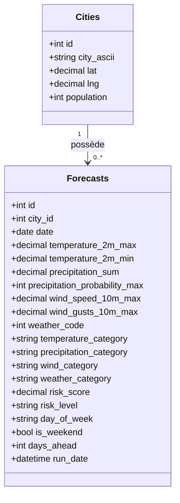

# Diagramme UML — MétéoRisk

```mermaid
classDiagram
    class Cities {
        +int id
        +string city_ascii
        +decimal lat
        +decimal lng
        +int population
    }

    class Forecasts {
        +int id
        +int city_id
        +date date
        +decimal temperature_2m_max
        +decimal temperature_2m_min
        +decimal precipitation_sum
        +int precipitation_probability_max
        +decimal wind_speed_10m_max
        +decimal wind_gusts_10m_max
        +int weather_code
        +string temperature_category
        +string precipitation_category
        +string wind_category
        +string weather_category
        +decimal risk_score
        +string risk_level
        +string day_of_week
        +bool is_weekend
        +int days_ahead
        +datetime run_date
    }

    Cities "1" --> "0..*" Forecasts : possède
```
